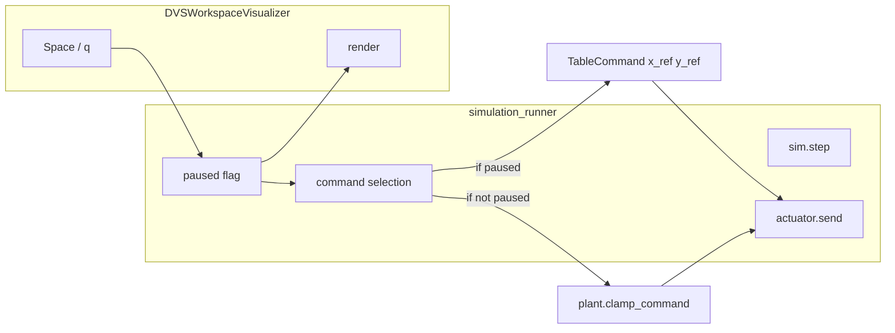

# Pause toggle and multi-point DVS calibration

## Part 1: Pause toggle (real cams only)

**Behavior**

- When real DVS cams are connected and realtime is on: **Space** toggles "system on" vs "system off".
- **ON**: Actuator receives controller output (clamped by plant); workspace shows green dot (controller command) as today.
- **OFF**: Actuator receives `TableCommand(x_ref, y_ref)` every tick so table stays at center; workspace shows a clear "paused" state (e.g. black/blurred with large overlay text like "System paused — table at center").

**Data flow**

- Pause state must be shared between runner and visualizer: runner decides what to send to actuator and what to pass to the visualizer; visualizer decides how to draw the workspace and captures Space.

**Implementation**

1. **Pause state and Space handling**
  - Add a mutable "pause" flag that the runner owns (e.g. `paused = False` at start). Only used when `real_cams and realtime` (real DVS + realtime).
  - In [simulation/simulation_runner.py](simulation/simulation_runner.py): in the realtime block, when calling the visualizer, pass the current `paused` state and allow the visualizer to return both "quit" and "toggle pause" (e.g. return a small result: `quit_requested: bool`, `toggle_pause: bool`). So: `quit_requested, toggle_pause = visualizer.render(..., paused=paused)`; if `toggle_pause`, flip `paused`.
  - When `paused` is True: in the same realtime block, send `TableCommand(params.workspace.x_ref, params.workspace.y_ref)` to the actuator instead of `plant.clamp_command(command)`. Still run `sim.step` so measurement/state stay fresh for when you unpause.
2. **Visualizer API and workspace when paused**
  - Extend [visualization/realtime_visualizer.py](visualization/realtime_visualizer.py) `DVSWorkspaceVisualizer.render()` to accept an optional `paused: bool` and return two values: `(quit_requested: bool, toggle_pause: bool)`. Use `cv2.waitKey(1)` once; if key is `ord(' ')` set `toggle_pause = True`, if `ord('q')` set `quit_requested = True`.
  - When `paused` is True and we have a workspace window: instead of drawing the normal grid + green dot, draw a "paused" view:
    - Option A: Fill workspace canvas with black (or dark gray), then overlay one large line of text, e.g. "System paused — table at center", using `cv2.putText` with a large font scale and thick stroke so it stays readable. Option B: blur the current workspace frame (e.g. `cv2.GaussianBlur`) then overlay the same text. Prefer a simple, high-contrast look (dark background + white/bright text, large font, possibly `cv2.getTextSize` to center the string).
  - OpenCV: use `cv2.putText` with `fontFace=cv2.FONT_HERSHEY_SIMPLEX` (or `_DUPLEX`), `fontScale` (e.g. 0.8–1.2 for 350px window), `thickness=2`, and optionally a second pass with a darker outline for readability. No built-in "blurred background" beyond `cv2.GaussianBlur(canvas, (k,k), 0)` then draw on top.
3. **Runner–visualizer contract**
  - Only [DVSWorkspaceVisualizer](visualization/realtime_visualizer.py) needs the new `paused` and return signature; [PencilVisualizerRealtime](visualization/realtime_visualizer.py) can keep returning only `quit_requested` (and never set `toggle_pause`) so existing sim-only paths stay unchanged. In the runner, when the visualizer returns a single value (old API), treat `toggle_pause` as False.

---

## Part 3: Optional / polish

- **Doc**: In [docs/architecture.MD](docs/architecture.MD): real-DVS pause (Space)